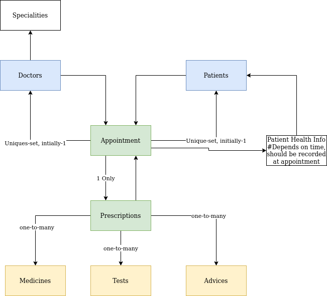

# Data Tables
## Tables
*All tables have id as Primary Key*
* doctors: (name, email, phone, )
* patients: (name, email, phone)
* appointment: (start_time, end_time, prescription, by_doctor, to_patient)
* prescriptions|Containes overall comments : (on_medicines, on_tests, on_advices)
    * medicines: (name, description)
    * tests: (name, description)
    * advices: (description)

Layout plan 
